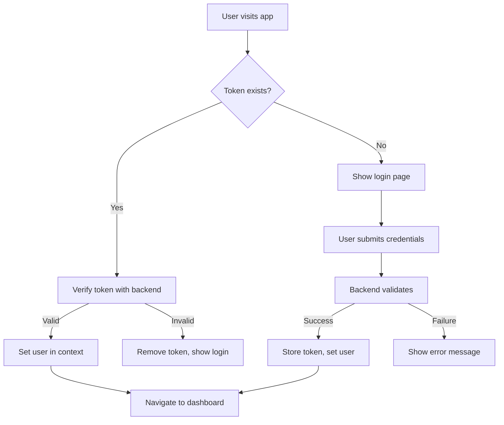

# CampusCogni Frontend

A modern, responsive frontend application for the CampusCogni campus recruitment platform. Built with Next.js 15, React, TypeScript, and Tailwind CSS to provide an exceptional user experience for both students and recruiters.

## 🚀 Tech Stack

| Technology | Purpose | Version |
|------------|---------|---------|
| **Next.js** | React framework | v15.x |
| **React** | UI library | v18.x |
| **TypeScript** | Type safety | v5.x |
| **Tailwind CSS** | Styling framework | v3.x |
| **shadcn/ui** | Component library | Latest |
| **Framer Motion** | Animations | v11.x |
| **Lucide React** | Icons | v0.x |
| **React Hook Form** | Form handling | v7.x |
| **Sonner** | Toast notifications | v1.x |

## 📁 Project Structure

```
frontend/
├── app/                          # Next.js 15 App Router
│   ├── globals.css              # Global styles
│   ├── layout.tsx               # Root layout
│   ├── page.tsx                 # Landing page
│   ├── auth/
│   │   ├── loading.tsx          # Auth loading state
│   │   └── page.tsx             # Login/Signup page
│   ├── student/
│   │   ├── dashboard/
│   │   │   └── page.tsx         # Student dashboard
│   │   ├── profile/
│   │   │   └── page.tsx         # Student profile management
│   │   ├── applications/
│   │   │   ├── loading.tsx      # Applications loading
│   │   │   └── page.tsx         # Job applications tracker
│   │   ├── cv-builder/
│   │   │   └── page.tsx         # Interactive CV builder
│   │   └── register/
│   │       └── page.tsx         # Student registration
│   └── recruiter/
│       ├── dashboard/
│       │   └── page.tsx         # Recruiter dashboard
│       ├── post-job/
│       │   └── page.tsx         # Job posting form
│       ├── applications/
│       │   ├── loading.tsx      # Applications loading
│       │   └── page.tsx         # Application management
│       └── register/
│           └── page.tsx         # Recruiter registration
├── components/                   # Reusable components
│   ├── ui/                      # shadcn/ui components
│   │   ├── button.tsx
│   │   ├── card.tsx
│   │   ├── input.tsx
│   │   ├── form.tsx
│   │   └── ... (30+ components)
│   ├── background-paths.tsx     # Animated background
│   ├── floating-navbar.tsx     # Navigation component
│   ├── footer.tsx              # Footer component
│   ├── navbar.tsx              # Main navigation
│   ├── theme-provider.tsx      # Dark/light theme
│   └── theme-toggle.tsx        # Theme switcher
├── contexts/
│   └── AuthContext.tsx          # Authentication context
├── hooks/
│   ├── use-mobile.tsx           # Mobile detection
│   └── use-toast.ts             # Toast notifications
├── lib/
│   ├── api.ts                   # Backend API client
│   └── utils.ts                 # Utility functions
├── public/                      # Static assets
│   ├── placeholder-user.jpg
│   └── placeholder.svg
├── styles/
│   └── globals.css              # Global CSS styles
├── .env.local                   # Environment variables
├── components.json              # shadcn/ui config
├── next.config.mjs              # Next.js configuration
├── tailwind.config.ts           # Tailwind CSS config
└── tsconfig.json                # TypeScript config
```

## 🎨 Design System

### Color Palette
```css
/* Light Mode */
--background: 0 0% 100%;
--foreground: 222.2 84% 4.9%;
--primary: 222.2 47.4% 11.2%;
--primary-foreground: 210 40% 98%;
--secondary: 210 40% 96%;
--muted: 210 40% 96%;
--accent: 210 40% 96%;
--destructive: 0 84.2% 60.2%;

/* Dark Mode */
--background: 222.2 84% 4.9%;
--foreground: 210 40% 98%;
--primary: 210 40% 98%;
--primary-foreground: 222.2 47.4% 11.2%;
/* ... */
```

### Typography Scale
```css
.text-xs    { font-size: 0.75rem; }   /* 12px */
.text-sm    { font-size: 0.875rem; }  /* 14px */
.text-base  { font-size: 1rem; }      /* 16px */
.text-lg    { font-size: 1.125rem; }  /* 18px */
.text-xl    { font-size: 1.25rem; }   /* 20px */
.text-2xl   { font-size: 1.5rem; }    /* 24px */
.text-3xl   { font-size: 1.875rem; }  /* 30px */
.text-4xl   { font-size: 2.25rem; }   /* 36px */
```

### Component Variants
```typescript
// Button variants
<Button variant="default">Primary</Button>
<Button variant="secondary">Secondary</Button>
<Button variant="outline">Outline</Button>
<Button variant="ghost">Ghost</Button>
<Button variant="destructive">Destructive</Button>

// Size variants
<Button size="sm">Small</Button>
<Button size="default">Default</Button>
<Button size="lg">Large</Button>
```

## 🔐 Authentication System

### Auth Context Structure
```typescript
interface User {
  id: string
  email: string
  role: 'STUDENT' | 'RECRUITER'
  profile?: StudentProfile | RecruiterProfile
}

interface AuthContextType {
  user: User | null
  login: (email: string, password: string) => Promise<void>
  logout: () => void
  setUserFromToken: (token: string, userData: User) => void
  loading: boolean
}
```

### Authentication Flow


### Protected Routes
```typescript
// Authentication check in layout.tsx
useEffect(() => {
  if (!loading && !user) {
    router.push('/auth')
  }
}, [user, loading, router])

// Role-based access control
useEffect(() => {
  if (user && user.role !== 'STUDENT') {
    router.push('/recruiter/dashboard')
  }
}, [user, router])
```

## 🌐 API Integration

### API Client Architecture
```typescript
class ApiClient {
  private baseUrl = process.env.NEXT_PUBLIC_API_URL || 'http://localhost:5000/api'
  
  private async request(endpoint: string, options: RequestInit = {}) {
    const token = localStorage.getItem('token')
    
    const response = await fetch(`${this.baseUrl}${endpoint}`, {
      headers: {
        'Content-Type': 'application/json',
        ...(token && { 'Authorization': `Bearer ${token}` }),
        ...options.headers,
      },
      ...options,
    })
    
    if (!response.ok) {
      const error = await response.json().catch(() => ({ error: response.statusText }))
      throw new Error(error.error || `API Error: ${response.statusText}`)
    }
    
    return response.json()
  }
}
```

### API Methods
```typescript
// Authentication
registerStudent(data: StudentRegistrationData)
registerRecruiter(data: RecruiterRegistrationData)
login(email: string, password: string)
verifyToken()

// Student APIs
getStudentProfile(userId: string)
updateStudentProfile(userId: string, data: StudentProfileData)
getStudentApplications(userId: string)

// Jobs APIs
getJobs(filters?: JobFilters)
getJobDetails(jobId: string)
applyToJob(jobId: string, applicationData: ApplicationData)

// Recruiter APIs
getRecruiterJobs(recruiterId: string)
createJob(jobData: JobCreationData)
updateApplicationStatus(applicationId: string, status: string)
```

## 📱 Responsive Design

### Breakpoint System
```typescript
// Tailwind CSS breakpoints
const breakpoints = {
  sm: '640px',   // Small devices (phones)
  md: '768px',   // Medium devices (tablets)
  lg: '1024px',  // Large devices (laptops)
  xl: '1280px',  // Extra large devices (desktops)
  '2xl': '1536px' // 2X large devices (large desktops)
}
```

### Mobile-First Approach
```tsx
// Responsive grid example
<div className="grid grid-cols-1 md:grid-cols-2 lg:grid-cols-3 gap-4">
  {/* Cards adjust from 1 column on mobile to 3 on desktop */}
</div>

// Responsive navigation
<div className="hidden md:flex space-x-4">
  {/* Desktop navigation */}
</div>
<div className="md:hidden">
  {/* Mobile navigation */}
</div>
```

### Mobile Hook
```typescript
// hooks/use-mobile.tsx
export function useIsMobile() {
  const [isMobile, setIsMobile] = useState(false)
  
  useEffect(() => {
    const mql = window.matchMedia("(max-width: 768px)")
    const onChange = () => setIsMobile(mql.matches)
    mql.addEventListener("change", onChange)
    setIsMobile(mql.matches)
    return () => mql.removeEventListener("change", onChange)
  }, [])
  
  return isMobile
}
```

## 🎭 User Flows

### Student Registration Journey
```
Landing Page → Register as Student → Fill Profile Form → 
Submit Registration → Auto Login → CV Builder (with skip option) → 
Student Dashboard → Browse Jobs → Apply to Jobs
```

### Recruiter Registration Journey
```
Landing Page → Register as Recruiter → Fill Company Form → 
Submit Registration → Auto Login → Recruiter Dashboard → 
Post Jobs → Manage Applications
```

### Job Application Flow
```
Student Dashboard → Browse Jobs → View Job Details → 
Apply with CV → Track Application Status → 
Receive Updates via Notifications
```

## 🧩 Key Components

### Interactive CV Builder
```tsx
// Multi-step form with progress tracking
const cvSteps = [
  { id: "education", title: "Education", description: "Add educational background" },
  { id: "skills", title: "Skills", description: "List technical and soft skills" },
  { id: "projects", title: "Projects", description: "Showcase projects" },
  { id: "certifications", title: "Certifications", description: "Add certifications" },
  { id: "experience", title: "Experience", description: "Work experience" },
]

// Dynamic form rendering based on current step
const renderStepContent = () => {
  switch (cvSteps[currentStep].id) {
    case "education":
      return <EducationStep />
    case "skills":
      return <SkillsStep />
    // ... other steps
  }
}
```

### Job Cards with Actions
```tsx
<Card className="hover:shadow-lg transition-shadow">
  <CardHeader>
    <div className="flex justify-between items-start">
      <div>
        <CardTitle className="text-lg">{job.title}</CardTitle>
        <p className="text-muted-foreground">{job.company}</p>
      </div>
      <Badge variant={getBadgeVariant(job.type)}>
        {job.type}
      </Badge>
    </div>
  </CardHeader>
  <CardContent>
    <div className="space-y-2">
      <div className="flex items-center text-sm text-muted-foreground">
        <MapPin className="h-4 w-4 mr-1" />
        {job.location}
      </div>
      <div className="flex items-center text-sm text-muted-foreground">
        <DollarSign className="h-4 w-4 mr-1" />
        ₹{job.stipend?.toLocaleString()}
      </div>
    </div>
    <div className="mt-4 flex gap-2">
      <Button size="sm" onClick={() => handleApply(job.id)}>
        Apply Now
      </Button>
      <Button size="sm" variant="outline" onClick={() => handleViewDetails(job.id)}>
        View Details
      </Button>
    </div>
  </CardContent>
</Card>
```

### Dynamic Navigation
```tsx
const NavbarContent = () => {
  const { user } = useAuth()
  
  if (!user) {
    return <GuestNavigation />
  }
  
  return user.role === 'STUDENT' ? 
    <StudentNavigation /> : 
    <RecruiterNavigation />
}
```

## 🔧 State Management

### Context-Based Architecture
```typescript
// AuthContext for user authentication
const AuthContext = createContext<AuthContextType>()

// Theme context for dark/light mode
const ThemeContext = createContext<ThemeContextType>()

// Local state with React hooks
const [profile, setProfile] = useState<StudentProfile>()
const [jobs, setJobs] = useState<Job[]>([])
const [loading, setLoading] = useState(true)
```

### Form State Management
```typescript
// React Hook Form integration
const form = useForm<StudentProfileForm>({
  resolver: zodResolver(studentProfileSchema),
  defaultValues: {
    firstName: "",
    lastName: "",
    email: "",
    college: "",
    course: "",
    year: "",
    cgpa: "",
  }
})

const onSubmit = async (data: StudentProfileForm) => {
  try {
    await apiClient.updateStudentProfile(user!.id, data)
    toast.success("Profile updated successfully")
  } catch (error) {
    toast.error("Failed to update profile")
  }
}
```

## 🎨 Animations & Interactions

### Framer Motion Animations
```tsx
// Page transitions
<motion.div
  initial={{ opacity: 0, y: 20 }}
  animate={{ opacity: 1, y: 0 }}
  transition={{ duration: 0.8 }}
>
  <PageContent />
</motion.div>

// Stagger animations for lists
<motion.div
  variants={{
    hidden: { opacity: 0 },
    show: {
      opacity: 1,
      transition: {
        staggerChildren: 0.1
      }
    }
  }}
  initial="hidden"
  animate="show"
>
  {items.map((item, i) => (
    <motion.div
      key={i}
      variants={{
        hidden: { opacity: 0, y: 20 },
        show: { opacity: 1, y: 0 }
      }}
    >
      <ItemCard item={item} />
    </motion.div>
  ))}
</motion.div>
```

### Hover Effects & Micro-interactions
```css
/* Smooth transitions */
.transition-all { transition: all 0.2s ease-in-out; }

/* Hover effects */
.hover\:scale-105:hover { transform: scale(1.05); }
.hover\:shadow-lg:hover { box-shadow: 0 10px 15px -3px rgba(0, 0, 0, 0.1); }

/* Focus states for accessibility */
.focus\:ring-2:focus { ring-width: 2px; }
.focus\:ring-primary:focus { ring-color: hsl(var(--primary)); }
```

## 🚀 Getting Started

### Prerequisites
```bash
# Check Node.js version (v18+ required)
node --version

# Check npm version
npm --version
```

### Quick Start
```bash
# Clone repository
git clone <repository-url>
cd CampusCogni/frontend

# Install dependencies
npm install

# Set up environment variables
cp .env.example .env.local
# Edit .env.local with your values

# Start development server
npm run dev

# Open browser
open http://localhost:3000
```

### Development Commands
```bash
# Development
npm run dev          # Start dev server with hot reload
npm run build        # Build for production
npm run start        # Start production server
npm run lint         # Run ESLint
npm run lint:fix     # Fix ESLint issues
npm run type-check   # TypeScript validation

# Testing
npm run test         # Run Jest tests
npm run test:watch   # Run tests in watch mode
npm run test:coverage # Generate coverage report

# Dependencies
npm run analyze      # Bundle analyzer
npm outdated         # Check outdated packages
npm audit            # Security audit
```

## 📋 Environment Variables

### Required Variables
```env
# Backend API URL
NEXT_PUBLIC_API_URL="http://localhost:5000/api"

# Application URL (for OAuth redirects)
NEXTAUTH_URL="http://localhost:3000"
NEXTAUTH_SECRET="your-nextauth-secret-key"
```

### Optional Variables
```env
# Analytics
NEXT_PUBLIC_GA_ID="G-XXXXXXXXXX"

# Feature flags
NEXT_PUBLIC_ENABLE_NOTIFICATIONS="true"
NEXT_PUBLIC_ENABLE_DARK_MODE="true"

# External services
NEXT_PUBLIC_SENTRY_DSN="https://your-sentry-dsn"
```

## 🎯 Performance Optimization

### Next.js Optimizations
```typescript
// Image optimization
import Image from 'next/image'

<Image
  src="/placeholder.jpg"
  alt="Placeholder"
  width={300}
  height={200}
  priority={true}  // For above-the-fold images
  placeholder="blur"  // Blur placeholder
/>

// Dynamic imports for code splitting
const CVBuilder = dynamic(() => import('./CVBuilder'), {
  loading: () => <CVBuilderSkeleton />
})

// Font optimization
import { Inter } from 'next/font/google'
const inter = Inter({ subsets: ['latin'] })
```

### Bundle Optimization
```typescript
// next.config.mjs
const nextConfig = {
  experimental: {
    optimizeCss: true,
    optimizePackageImports: ['lucide-react', 'framer-motion']
  },
  compiler: {
    removeConsole: process.env.NODE_ENV === 'production'
  }
}
```

### Loading States & Skeletons
```tsx
// Skeleton components for better perceived performance
const JobCardSkeleton = () => (
  <Card>
    <CardHeader>
      <Skeleton className="h-6 w-3/4" />
      <Skeleton className="h-4 w-1/2" />
    </CardHeader>
    <CardContent>
      <Skeleton className="h-4 w-full mb-2" />
      <Skeleton className="h-4 w-2/3" />
    </CardContent>
  </Card>
)

// Suspense boundaries
<Suspense fallback={<JobListSkeleton />}>
  <JobList />
</Suspense>
```

## 🧪 Testing Strategy

### Component Testing
```typescript
// Example test with React Testing Library
import { render, screen, fireEvent } from '@testing-library/react'
import { JobCard } from './JobCard'

describe('JobCard', () => {
  it('renders job information correctly', () => {
    const mockJob = {
      id: '1',
      title: 'Software Engineer',
      company: 'Google',
      location: 'Mountain View',
      type: 'FULL_TIME'
    }
    
    render(<JobCard job={mockJob} />)
    
    expect(screen.getByText('Software Engineer')).toBeInTheDocument()
    expect(screen.getByText('Google')).toBeInTheDocument()
  })
  
  it('handles apply button click', () => {
    const handleApply = jest.fn()
    render(<JobCard job={mockJob} onApply={handleApply} />)
    
    fireEvent.click(screen.getByText('Apply Now'))
    expect(handleApply).toHaveBeenCalledWith(mockJob.id)
  })
})
```

### E2E Testing Setup
```typescript
// playwright.config.ts
import { defineConfig } from '@playwright/test'

export default defineConfig({
  testDir: './e2e',
  fullyParallel: true,
  forbidOnly: !!process.env.CI,
  retries: process.env.CI ? 2 : 0,
  workers: process.env.CI ? 1 : undefined,
  reporter: 'html',
  use: {
    baseURL: 'http://localhost:3000',
    trace: 'on-first-retry',
  },
  projects: [
    { name: 'chromium', use: { ...devices['Desktop Chrome'] } },
    { name: 'firefox', use: { ...devices['Desktop Firefox'] } },
    { name: 'webkit', use: { ...devices['Desktop Safari'] } },
    { name: 'Mobile Chrome', use: { ...devices['Pixel 5'] } },
  ],
})
```

## 🚀 Deployment

### Vercel (Recommended)
```bash
# Install Vercel CLI
npm i -g vercel

# Deploy
vercel --prod

# Set environment variables in Vercel dashboard
# NEXT_PUBLIC_API_URL=https://your-backend-url.com/api
```

### Netlify
```bash
# Build command: npm run build
# Publish directory: out
# Environment variables in Netlify dashboard
```

### Docker Deployment
```dockerfile
# Dockerfile
FROM node:18-alpine AS dependencies
WORKDIR /app
COPY package.json package-lock.json ./
RUN npm ci --only=production

FROM node:18-alpine AS builder
WORKDIR /app
COPY package.json package-lock.json ./
RUN npm ci
COPY . .
RUN npm run build

FROM node:18-alpine AS runner
WORKDIR /app
ENV NODE_ENV production
COPY --from=dependencies /app/node_modules ./node_modules
COPY --from=builder /app/.next ./.next
COPY --from=builder /app/public ./public
COPY --from=builder /app/package.json ./package.json

EXPOSE 3000
CMD ["npm", "start"]
```

## 🔍 SEO & Accessibility

### SEO Optimization
```typescript
// app/layout.tsx - Root metadata
export const metadata: Metadata = {
  title: 'CampusCogni - Campus Recruitment Platform',
  description: 'Connect students with top recruiters for internships and jobs',
  keywords: ['campus recruitment', 'internships', 'jobs', 'students'],
  authors: [{ name: 'CampusCogni Team' }],
  openGraph: {
    type: 'website',
    locale: 'en_US',
    url: 'https://campuscogni.com',
    siteName: 'CampusCogni',
  },
  twitter: {
    card: 'summary_large_image',
    site: '@campuscogni',
  },
}

// Page-specific metadata
export const metadata: Metadata = {
  title: 'Student Dashboard - CampusCogni',
  description: 'Manage your profile, browse jobs, and track applications',
}
```

### Accessibility Features
```tsx
// ARIA labels and semantic HTML
<nav aria-label="Main navigation">
  <ul role="list">
    <li role="listitem">
      <Link href="/dashboard" aria-current="page">
        Dashboard
      </Link>
    </li>
  </ul>
</nav>

// Focus management
const [isOpen, setIsOpen] = useState(false)
const triggerRef = useRef<HTMLButtonElement>(null)

useEffect(() => {
  if (!isOpen && triggerRef.current) {
    triggerRef.current.focus()
  }
}, [isOpen])

// Screen reader announcements
<div aria-live="polite" className="sr-only">
  {loading ? 'Loading jobs...' : `Found ${jobs.length} jobs`}
</div>
```

## 🐛 Error Handling

### Error Boundaries
```typescript
// components/ErrorBoundary.tsx
class ErrorBoundary extends Component<Props, State> {
  constructor(props: Props) {
    super(props)
    this.state = { hasError: false }
  }

  static getDerivedStateFromError(error: Error): State {
    return { hasError: true }
  }

  componentDidCatch(error: Error, errorInfo: ErrorInfo) {
    console.error('Error caught by boundary:', error, errorInfo)
  }

  render() {
    if (this.state.hasError) {
      return (
        <div className="min-h-screen flex items-center justify-center">
          <Card>
            <CardHeader>
              <CardTitle>Something went wrong</CardTitle>
            </CardHeader>
            <CardContent>
              <p>We're sorry, but something unexpected happened.</p>
              <Button onClick={() => window.location.reload()}>
                Reload page
              </Button>
            </CardContent>
          </Card>
        </div>
      )
    }

    return this.props.children
  }
}
```

### API Error Handling
```typescript
// Centralized error handling in API client
private async request(endpoint: string, options: RequestInit = {}) {
  try {
    const response = await fetch(`${this.baseUrl}${endpoint}`, options)
    
    if (!response.ok) {
      throw new ApiError(response.status, await response.json())
    }
    
    return response.json()
  } catch (error) {
    if (error instanceof ApiError) {
      throw error
    }
    throw new NetworkError('Network request failed')
  }
}
```

## 📊 Analytics & Monitoring

### Performance Monitoring
```typescript
// Web Vitals tracking
import { getCLS, getFID, getFCP, getLCP, getTTFB } from 'web-vitals'

function sendToAnalytics(metric: Metric) {
  // Send to your analytics service
  gtag('event', metric.name, {
    value: Math.round(metric.value),
    event_label: metric.id,
  })
}

getCLS(sendToAnalytics)
getFID(sendToAnalytics)
getFCP(sendToAnalytics)
getLCP(sendToAnalytics)
getTTFB(sendToAnalytics)
```

### User Analytics
```typescript
// Track user interactions
const trackEvent = (eventName: string, properties?: Record<string, any>) => {
  if (typeof window !== 'undefined' && window.gtag) {
    window.gtag('event', eventName, properties)
  }
}

// Usage
trackEvent('job_application_submitted', {
  job_id: jobId,
  job_title: job.title,
  company: job.company
})
```

## 🔐 Security Best Practices

### XSS Prevention
```typescript
// Safe HTML rendering
import DOMPurify from 'isomorphic-dompurify'

const SafeHTML = ({ html }: { html: string }) => (
  <div dangerouslySetInnerHTML={{ 
    __html: DOMPurify.sanitize(html) 
  }} />
)
```

### CSRF Protection
```typescript
// CSRF token handling
const csrfToken = await fetch('/api/csrf-token').then(r => r.text())

fetch('/api/protected-endpoint', {
  method: 'POST',
  headers: {
    'Content-Type': 'application/json',
    'X-CSRF-Token': csrfToken
  },
  body: JSON.stringify(data)
})
```

### Content Security Policy
```typescript
// next.config.mjs
const nextConfig = {
  async headers() {
    return [
      {
        source: '/(.*)',
        headers: [
          {
            key: 'Content-Security-Policy',
            value: "default-src 'self'; script-src 'self' 'unsafe-eval' 'unsafe-inline'"
          }
        ]
      }
    ]
  }
}
```

## 📱 Progressive Web App (PWA)

### PWA Configuration
```typescript
// next.config.mjs with next-pwa
const withPWA = require('next-pwa')({
  dest: 'public',
  register: true,
  skipWaiting: true,
})

module.exports = withPWA({
  // Next.js config
})
```

### Service Worker
```javascript
// public/sw.js
self.addEventListener('push', event => {
  const data = event.data.json()
  
  event.waitUntil(
    self.registration.showNotification(data.title, {
      body: data.body,
      icon: '/icon-192x192.png',
      badge: '/badge-72x72.png',
    })
  )
})
```

## 🆘 Troubleshooting

### Common Issues

1. **Hydration Errors**
   ```typescript
   // Use useEffect for client-only code
   useEffect(() => {
     setMounted(true)
   }, [])
   
   if (!mounted) return null
   ```

2. **API Connection Issues**
   ```bash
   # Check if backend is running
   curl http://localhost:5000/health
   
   # Verify environment variables
   echo $NEXT_PUBLIC_API_URL
   ```

3. **Build Errors**
   ```bash
   # Clear Next.js cache
   rm -rf .next
   
   # Reinstall dependencies
   rm -rf node_modules package-lock.json
   npm install
   ```

4. **CORS Issues**
   ```typescript
   // Check backend CORS configuration
   // Ensure frontend URL is in CORS origins
   ```

### Debug Mode
```typescript
// Enable debug mode in development
if (process.env.NODE_ENV === 'development') {
  window.DEBUG = true
  console.log('Debug mode enabled')
}
```

This frontend provides a modern, accessible, and performant user interface for the CampusCogni platform with comprehensive documentation for developers to understand and extend the codebase effectively!
